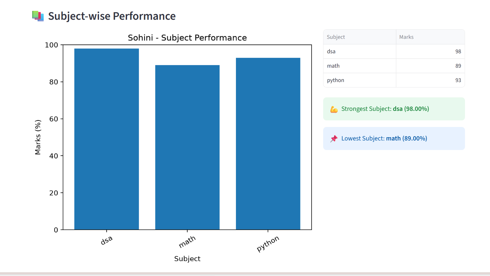

# 📊 Student Performance Analyzer

A Python-based academic analytics application that analyzes student performance, subject-wise marks, study habits, learning patterns, and academic progress.

The project started as a Python learning project and has evolved into a feature-rich data analysis application using **Python, Pandas, Matplotlib, ReportLab, and Streamlit**.

---

## 🚀 Features

### 👨‍🎓 Student Management

* Add student records
* Update existing student records
* Store subject-wise marks
* Calculate total marks and percentage
* Automatically calculate grades
* View all students
* Search for individual students

### 👤 Student Profile

* Detailed academic profile
* Performance category
* Strongest subject
* Weakest subject
* Study-hour analysis
* Personalized learning recommendations
* Learning insights

### ⚖️ Student Comparison

* Compare two students
* Compare total marks and percentage
* Compare grades and performance categories
* Subject-wise comparison
* Identify subject winners
* Analyze performance gaps
* Compare learning habits when data is available

### 📊 Class Performance Dashboard

* Total students
* Class average
* Highest and lowest percentage
* Top performers
* Student needing most attention
* Pass rate
* Grade distribution
* Performance categories
* Subject performance
* Learning-habit statistics
* Class-level insights
* Academic recommendations

### 📈 Performance Trend Analysis

* Compare current and previous performance
* Track percentage changes
* Track grade changes
* View performance history
* Identify improving, declining, or stable performance

### 🧮 Advanced Analytics

* Dataset summary
* Class average
* Top-performing student
* Lowest-performing student
* Grade statistics
* Performance categories
* Subject averages
* Study-hour statistics
* Study hours vs performance
* Personalized learning recommendations

### 🐼 Pandas Data Analysis

* Statistical summary
* Mean and median performance
* Student ranking
* Grade distribution
* Performance categories
* Subject statistics
* Study-hour statistics
* Study hours vs performance analysis
* Correlation analysis

### 📊 Data Visualizations

The project generates five analytical charts:

1. Student Performance
2. Subject Performance
3. Grade Distribution
4. Performance Categories
5. Study Hours vs Performance

Charts are automatically saved as PNG files inside the `charts/` directory.

### 📄 Report Generation

* Generate individual student text reports
* Generate professional PDF student reports
* Store generated reports inside the `reports/` directory

### 🌐 Interactive Streamlit Dashboard

The project also includes an interactive web-based dashboard built with Streamlit.

The dashboard provides:

* Class performance overview
* Student profiles
* Student rankings
* Performance charts
* Grade distribution
* Performance categories
* Subject performance
* Study-hours analysis
* Performance trends
* Personalized learning insights
* Filtered class data

---

## 🛠️ Technologies Used

* **Python** — application development
* **CSV** — data storage
* **Pandas** — data analysis
* **Matplotlib** — data visualization
* **ReportLab** — PDF report generation
* **Streamlit** — interactive dashboard
* **Git** — version control
* **GitHub** — project hosting

---

## 📁 Project Structure

```text
student-performance-analyzer/
│
├── main.py
├── dashboard.py
├── student.py
├── analyzer.py
├── analytics.py
├── data_analysis.py
├── visualizations.py
├── student_profile.py
├── performance_comparison.py
├── performance_trend.py
├── class_dashboard.py
├── report_generator.py
├── pdf_report_generator.py
├── utils.py
│
├── data/
│   ├── students.csv
│   ├── subject_marks.csv
│   ├── study_hours.csv
│   └── performance_history.csv
│
├── charts/
│   └── Generated visualization charts
│
├── reports/
│   └── Generated student reports
│
├── screenshots/
│   ├── 01_dashboard_overview.png
│   ├── 02_student_profile.png
│   ├── 04_student_performance.png
│   ├── 05_grade_distribution.png
│   ├── 06_performance_categories.png
│   ├── 07_subject_performance.png
│   ├── 08_study_hours_analysis.png
│   ├── 09_performance_trend.png
│   └── 10_learning_insight.png
│
├── requirements.txt
├── .gitignore
└── README.md
```

---

## 📸 Dashboard Preview

The Student Performance Analyzer includes an interactive Streamlit dashboard for exploring academic performance, subject-wise analysis, rankings, learning habits, and performance trends.

### 📊 Dashboard Overview


### 👤 Student Profile


### 📈 Student Performance



### 🎓 Grade Distribution


### 📌 Performance Categories


### 📚 Subject Performance


### ⏱️ Study Hours vs Performance


### 📈 Performance Trend


### 💡 Personalized Learning Insight


---

## ▶️ How to Run

### 1. Clone the repository

```bash
git clone https://github.com/ballsohini939-alt/student-performance-analyzer.git
```

### 2. Open the project directory

```bash
cd student-performance-analyzer
```

### 3. Install dependencies

```bash
pip install -r requirements.txt
```

### 4. Run the Python application

```bash
python main.py
```

### 5. Run the Streamlit dashboard

```bash
streamlit run dashboard.py
```

The Streamlit dashboard will open in your browser.

---

## 📊 Example Capabilities

The application can provide:

* Individual student profiles
* Academic performance comparisons
* Class-level performance dashboards
* Student rankings
* Performance trend analysis
* Statistical analysis using Pandas
* Correlation analysis between study hours and performance
* Automated visualization generation
* Personalized learning recommendations
* Text-based student reports
* Professional PDF student reports
* Interactive Streamlit dashboard
* Filtered class-level analysis

---

## 📌 Project Status

**Completed Core Analytics Version + Interactive Dashboard**

The project currently includes:

* Student management
* Academic analytics
* Pandas-based data analysis
* Data visualization
* Performance tracking
* Student comparison
* Class dashboard
* Performance trend analysis
* Personalized learning insights
* Automated text reports
* Professional PDF reports
* Interactive Streamlit dashboard

### 🔮 Future Improvements

Planned improvements may include:

* SQLite database integration
* Advanced interactive dashboard features
* Automated testing
* More advanced predictive analytics
* Machine-learning-based performance prediction
* Improved data management
* Exportable analytical dashboards

---

## 👩‍💻 Author

**Sohini Ball**

B.Tech CSE Student | Aspiring Software Engineer

This project is part of my journey of learning Python, data analysis, and practical software development while building projects for my GitHub portfolio.

---

## ⭐ Project Highlights

This project demonstrates practical experience with:

**Python → Data Handling → Pandas → Analytics → Visualization → Reporting → Streamlit Dashboard**

It combines multiple Python concepts into a complete academic analytics application rather than a collection of isolated programs.

---

⭐ If you find this project useful, consider giving the repository a star!
