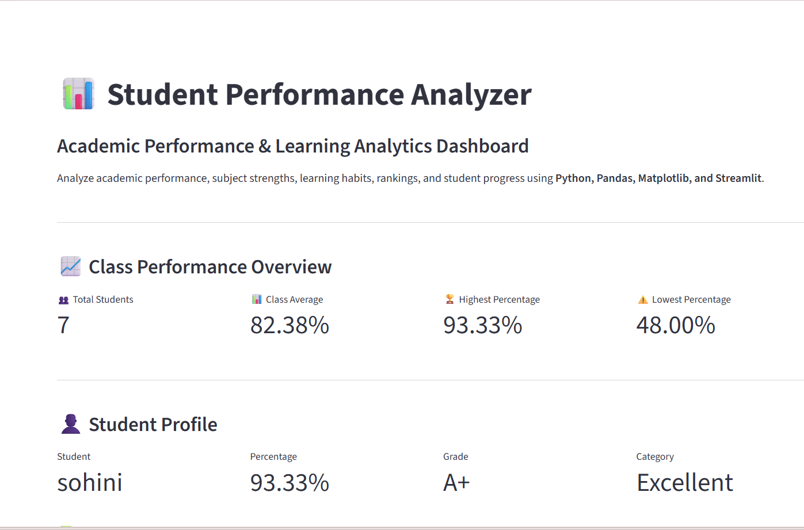
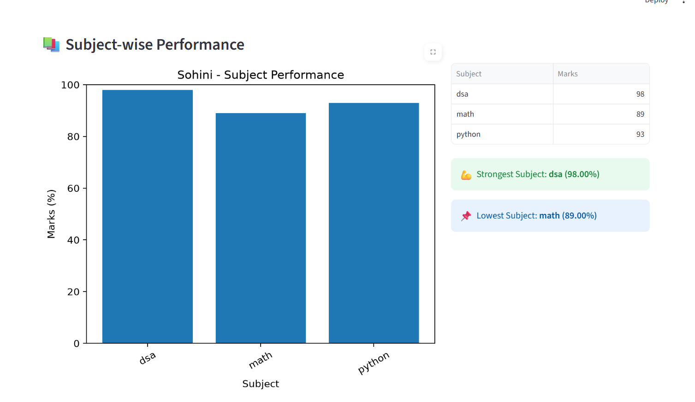
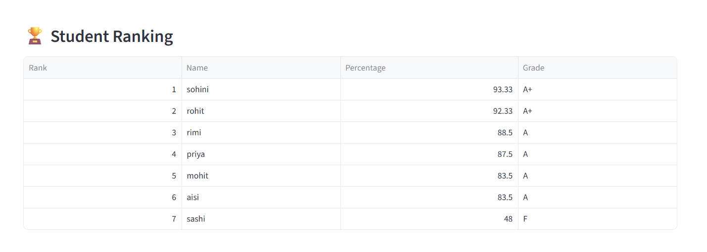
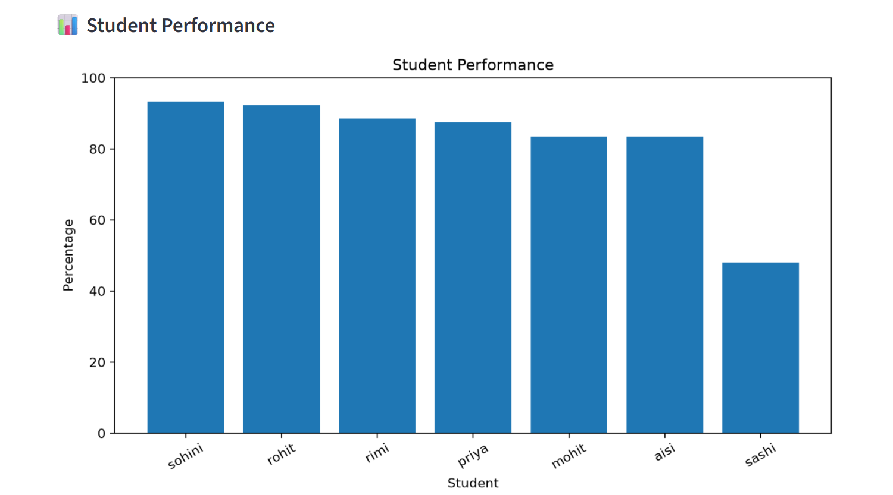
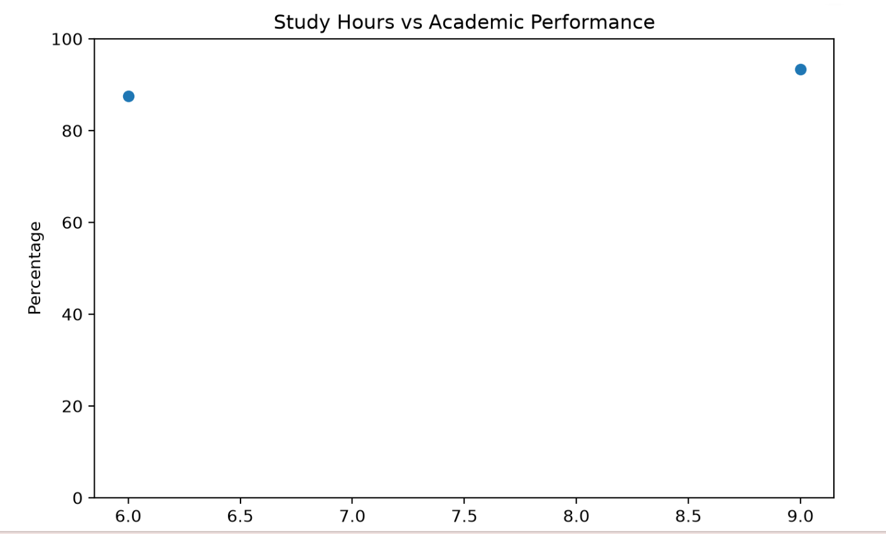
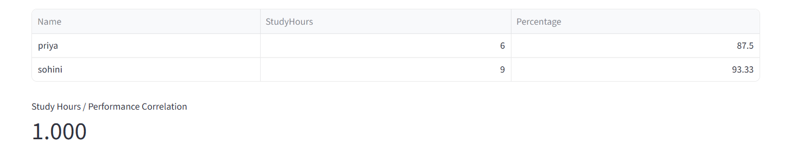
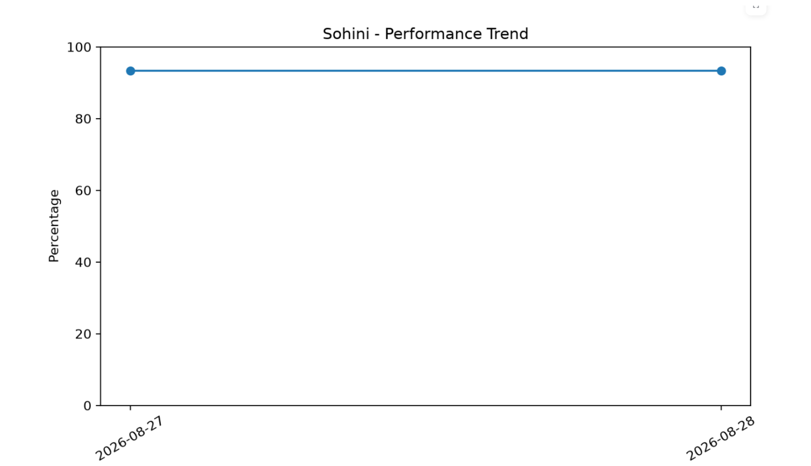
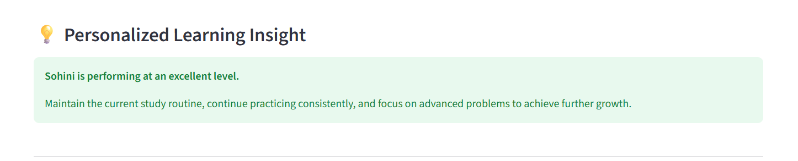

# 📊 Student Performance Analyzer

### Academic Performance & Learning Analytics Dashboard

A Python-based academic analytics application that helps analyze **student performance, subject-wise marks, learning habits, rankings, performance trends, and personalized learning insights**.

Built using **Python, Pandas, Matplotlib, ReportLab, and Streamlit**.

---

## 🚀 Project Overview

**Student Performance Analyzer** started as a Python learning project and evolved into a feature-rich academic analytics application.

The system allows users to manage student records, analyze academic performance, compare students, visualize class-level statistics, track performance trends, generate reports, and explore personalized learning insights through an interactive Streamlit dashboard.

---

## ✨ Key Features

### 👨‍🎓 Student Management

* Add student records
* Update existing student records
* Store subject-wise marks
* Calculate total marks
* Calculate percentage
* Automatically determine grades
* View all students
* Search for individual students

### 👤 Student Profile

* Detailed academic profile
* Percentage and grade
* Performance category
* Strongest subject
* Weakest subject
* Study-hour analysis
* Personalized learning recommendations
* Learning insights

### ⚖️ Student Comparison

* Compare two students
* Compare total marks
* Compare percentages
* Compare grades
* Compare performance categories
* Subject-wise comparison
* Identify subject winners
* Analyze performance gaps
* Compare learning habits when data is available

### 📊 Class Performance Dashboard

* Total number of students
* Class average
* Highest percentage
* Lowest percentage
* Top performers
* Student needing most attention
* Pass rate
* Grade distribution
* Performance categories
* Subject performance
* Learning-habit statistics
* Class-level insights
* Academic recommendations

### 📈 Performance Trend Analysis

* Compare current and previous performance
* Track percentage changes
* Track grade changes
* View performance history
* Identify improving students
* Identify declining students
* Identify stable performance

### 🧮 Advanced Analytics

* Dataset summary
* Class average
* Top-performing student
* Lowest-performing student
* Grade statistics
* Performance categories
* Subject averages
* Study-hour statistics
* Study hours vs performance
* Correlation analysis
* Personalized learning recommendations

### 🐼 Pandas Data Analysis

* Statistical summary
* Mean and median performance
* Student ranking
* Grade distribution
* Performance categories
* Subject statistics
* Study-hour statistics
* Study hours vs performance
* Correlation analysis

### 📊 Data Visualization

The application generates analytical visualizations for:

1. Student Performance
2. Grade Distribution
3. Performance Categories
4. Subject Performance
5. Study Hours vs Performance
6. Performance Trends

Charts are generated using **Matplotlib**.

### 📄 Report Generation

* Generate individual student text reports
* Generate professional PDF student reports
* Store generated reports inside the `reports/` directory

---

# 🖥️ Interactive Streamlit Dashboard

The project includes an interactive **Streamlit dashboard** that brings the analytics together in one interface.

### Run the dashboard

```bash
streamlit run dashboard.py
```

The dashboard provides:

* 📈 Class performance overview
* 👤 Student profiles
* 📚 Subject-wise performance
* 🏆 Student rankings
* 📊 Performance charts
* 🎓 Grade distribution
* 📌 Performance categories
* ⏱️ Study-hours analysis
* 📈 Performance trends
* 💡 Personalized learning insights
* 🔎 Class data filtering

---

# 📸 Dashboard Screenshots

Below are screenshots of the interactive Streamlit dashboard.

## 📊 Dashboard Overview & Student Profile



---

## 👤 Subjectwise Performance



---

## 🎓 Grade Distribution



---

## 📌 Performance Categories



---

## 📚 Student's Performance



---

## ⏱️ Study Hours vs Performance



---

## 📈 Performance Trend



---

## 💡 Personalized Learning Insight



---

# 🛠️ Technologies Used

| Technology     | Purpose                 |
| -------------- | ----------------------- |
| **Python**     | Application development |
| **CSV**        | Data storage            |
| **Pandas**     | Data analysis           |
| **Matplotlib** | Data visualization      |
| **ReportLab**  | PDF report generation   |
| **Streamlit**  | Interactive dashboard   |
| **Git**        | Version control         |
| **GitHub**     | Project hosting         |

---

# 📁 Project Structure

```text
student-performance-analyzer/
│
├── main.py
├── dashboard.py
├── student.py
├── analyzer.py
├── analytics.py
├── data_analysis.py
├── visualizations.py
├── student_profile.py
├── performance_comparison.py
├── performance_trend.py
├── class_dashboard.py
├── report_generator.py
├── pdf_report_generator.py
├── utils.py
│
├── data/
│   ├── students.csv
│   ├── subject_marks.csv
│   ├── study_hours.csv
│   └── performance_history.csv
│
├── charts/
│   └── Generated analytical charts
│
├── reports/
│   └── Generated student reports
│
├── screenshots/
│   ├── 01_dashboard_overview.png
│   ├── 02_student_profile.png
│   ├── 05_grade_distribution.png
│   ├── 06_performance_categories.png
│   ├── 07_subject_performance.png
│   ├── 08_study_hours_analysis.png
│   ├── 09_performance_trend.png
│   └── 10_learning_insight.png
│
├── requirements.txt
├── .gitignore
└── README.md
```

---

# ⚙️ Installation & Setup

## 1. Clone the Repository

```bash
git clone https://github.com/ballsohini939-alt/student-performance-analyzer.git
```

## 2. Open the Project Directory

```bash
cd student-performance-analyzer
```

## 3. Install Dependencies

```bash
pip install -r requirements.txt
```

## 4. Run the Console Application

```bash
python main.py
```

## 5. Run the Streamlit Dashboard

```bash
streamlit run dashboard.py
```

The dashboard will open in your browser.

---

# 📊 Example Capabilities

The application can provide:

* Individual student profiles
* Student rankings
* Academic performance comparisons
* Class-level dashboards
* Subject-wise analysis
* Grade distribution
* Performance categories
* Study-hours analysis
* Performance trend analysis
* Statistical analysis using Pandas
* Correlation analysis
* Data visualization
* Personalized learning recommendations
* Text-based reports
* Professional PDF reports

---

# 🎯 Project Goals

The main goals of this project are to:

* Practice Python programming
* Apply Pandas to real-world datasets
* Understand data analysis workflows
* Create meaningful data visualizations
* Build an interactive analytics dashboard
* Generate useful academic insights
* Develop a practical portfolio project

---

# 🔮 Future Improvements

Planned improvements include:

* 🗄️ SQLite database integration
* 📊 More interactive dashboard controls
* 🧪 Automated testing
* 🤖 Machine-learning-based performance prediction
* 📈 More advanced predictive analytics
* 📤 CSV/Excel data import
* 👨‍🏫 Teacher/admin dashboard
* 📱 Improved responsive dashboard experience

---

# 📌 Project Status

### ✅ Completed Core Analytics + Interactive Dashboard Version

The project currently includes:

* ✅ Student management
* ✅ Academic analytics
* ✅ Pandas-based analysis
* ✅ Data visualization
* ✅ Student comparison
* ✅ Performance tracking
* ✅ Class dashboard
* ✅ Study-hour analysis
* ✅ Personalized learning insights
* ✅ Text report generation
* ✅ PDF report generation
* ✅ Interactive Streamlit dashboard
* ✅ Dashboard screenshots and documentation

---

# 👩‍💻 Author

**Sohini Ball**

B.Tech CSE Student | Aspiring Software Engineer

This project is part of my journey of learning **Python, data analysis, visualization, and practical software development**.

---

## ⭐ If you find this project useful

Consider giving the repository a **star ⭐** and exploring the project.
